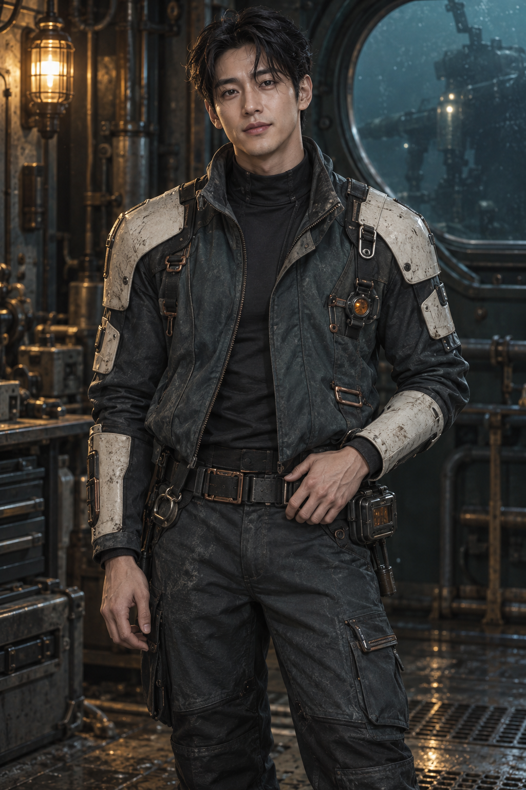
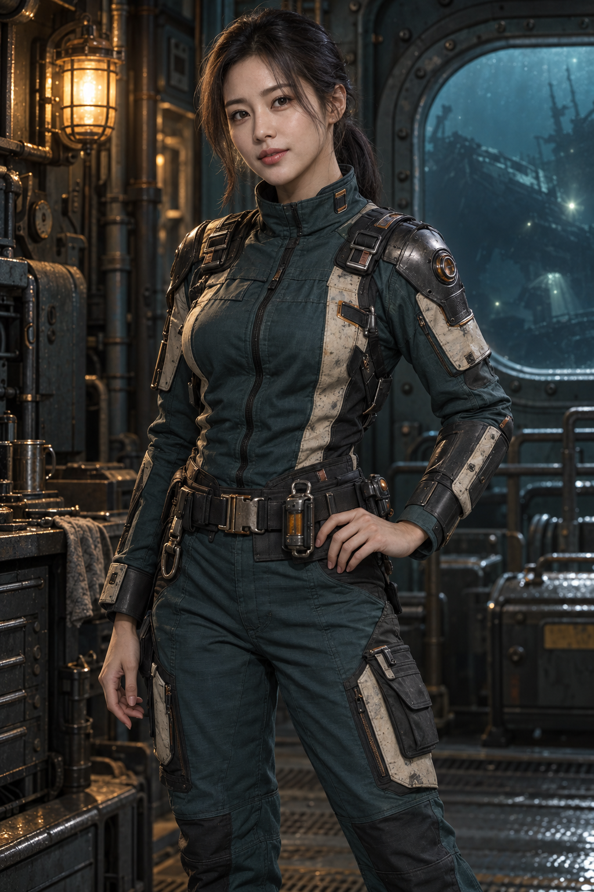

# DEEP PRESS — 선택용 한국인 남녀 캐릭터

후속 기록: 사용자가 이 캐릭터를 이야기·튜토리얼에 채택하도록 요청해 [대화용 포즈4종](../korean-salvagers-story-v1/README.md)을 새로 생성하고 게임에 적용했다. 아래 원본 PNG 자체는 배포하지 않으며 덮어쓰지 않았다. 아래의 “미적용”은 최초 콘셉트 생성 당시 기록이다.

**상태: 선택용 콘셉트 / 게임 미적용.** 한국인 미남·미녀 인상의 가상 성인 회수팀 캐릭터 2종이다. DEEP PRESS의 심해 작업실에 맞춰 청록 작업복, 마모된 아이보리 보호구, 구리·흑색 금속, 호박색 장비와 조명을 공유한다. OpenAI 내장 ImageGen으로 각각 생성한 원본이며, 기존 인물의 사진이나 얼굴을 참조하지 않았다.

## 남성 회수팀 캐릭터

30세 설정. 검은 가르마 머리, 차콜 작업 재킷과 하이넥, 아이보리 보호구, 허리 진단 장비. 차분하고 자신감 있는 인상이다.

## 여성 회수팀 캐릭터

29세 설정. 낮게 묶은 검은 머리, 청록색 하이칼라 작업복, 금속·아이보리 보호구, 구리와 호박색 장비. 부드럽고 침착한 인상이다.

## 원본과 사용 범위

- 각 PNG는 **1024×1536**, 생성 결과를 편집 없이 복사했다. [정확한 생성 프롬프트](prompts.json)와 [파일 크기·SHA-256·생성 기록](provenance.json)을 함께 보존한다.
- 생성된 콘셉트 이미지다. 실행 화면, 구현된 NPC, 3D 모델 또는 실제 게임의 그래픽 품질 증거가 아니다.
- 두 이미지 모두 배경을 포함한다. 투명 배경 초상화, 표정 세트, 턴어라운드, 리깅·애니메이션은 아직 없다.
- 이 폴더는 `assets/source/`에 있으며 런타임에서 import하지 않는다. `public/assets/` 및 배포 파일에 추가하지 않아 현재 게임 다운로드 용량을 늘리지 않는다.
- 사용 여부·이름·서사·게임 기능은 정하지 않았다. 팀이 채택하면 실제 용도에 맞는 후속 에셋을 만들고 적용 범위를 합의한다. 3D화할 때는 B가 ImageGen 원본 → Meshy 7 flagship → 고품질 PBR → 런타임 최적화 절차를 담당한다.

[B 렌더링 인계로 돌아가기](../../../../docs/handoffs/B/README.md)
