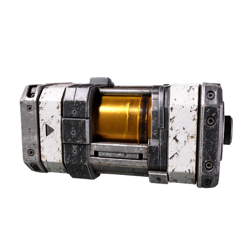
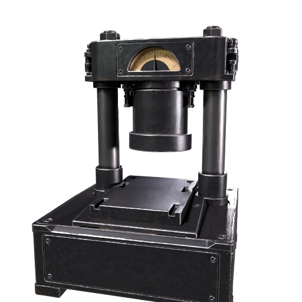

# Meshy 7 원본 — 런타임 파일 아님

ImageGen 입력 → Meshy CLI 0.4.0 standard + 명시적 `ai_model=meshy-7`, texture=true, PBR=true, base color 4K 요청. 두 작업 모두 SUCCEEDED, 각 30크레딧/총60. 추가 유료 remesh·ultra·재생성은 수행하지 않았다. API 완료 응답은 모델 이름을 다시 반환하지 않았으며 요청 모델과 CLI 정의를 provenance에 기록했다.

| 파일 | 크기 bytes | triangle | 이미지 해상도 | 상태 |
|---|---:|---:|---|---|
| [카세트 master](salvage-cassette/salvage-cassette-master.glb) | 63,499,220 | 1,158,358 | 4096² / 2048² / 4096² | generated-unverified |
| [프레스 master](press-chamber/press-chamber-master.glb) | 47,883,172 | 775,612 | 4096² / 2048² / 4096² | generated-unverified |

GLB binary의 meshes/accessors/materials/images를 읽어 측정했다. base color와 normal은 4K, metallic/roughness는 2K다. 모두 단일 mesh·단일 primitive다. 프레스 누름판이 독립 부품으로 준비된 모델이 아니다. 작업 ID·입력 해시·원본 해시·실제 PBR 연결은 각 provenance.json에 있다. 다운로드 URL과 계정 정보는 공유하지 않는다.

서비스 미리보기로 의도한 물체의 형상과 재질이 식별되는 것만 확인했다. 실행 렌더러·후면 형상·실기기·변형은 미검증이다. B는 기존 master를 재사용하고, 움직일 부품 분리·피벗·크기·압착 변형·모바일 최적화 후 public/assets/models에 별도의 파일을 만든다. PRD의 150k visible triangle/20MB 첫 로드 예산에 원본 그대로는 들어가지 않는다. 원본 파일을 덮어쓰지 않는다.
