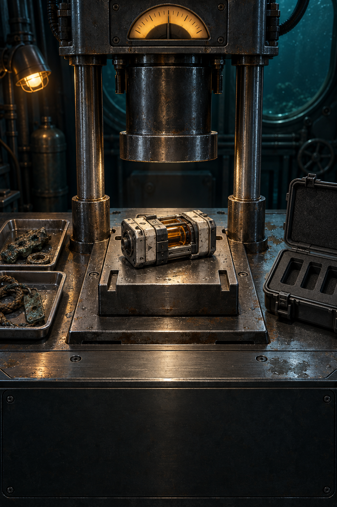
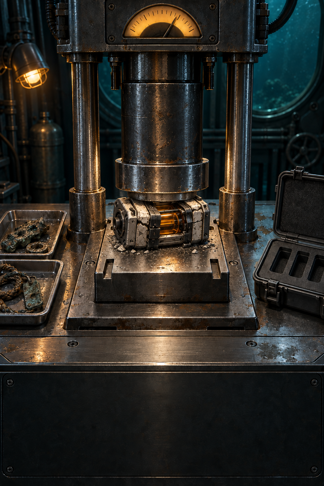
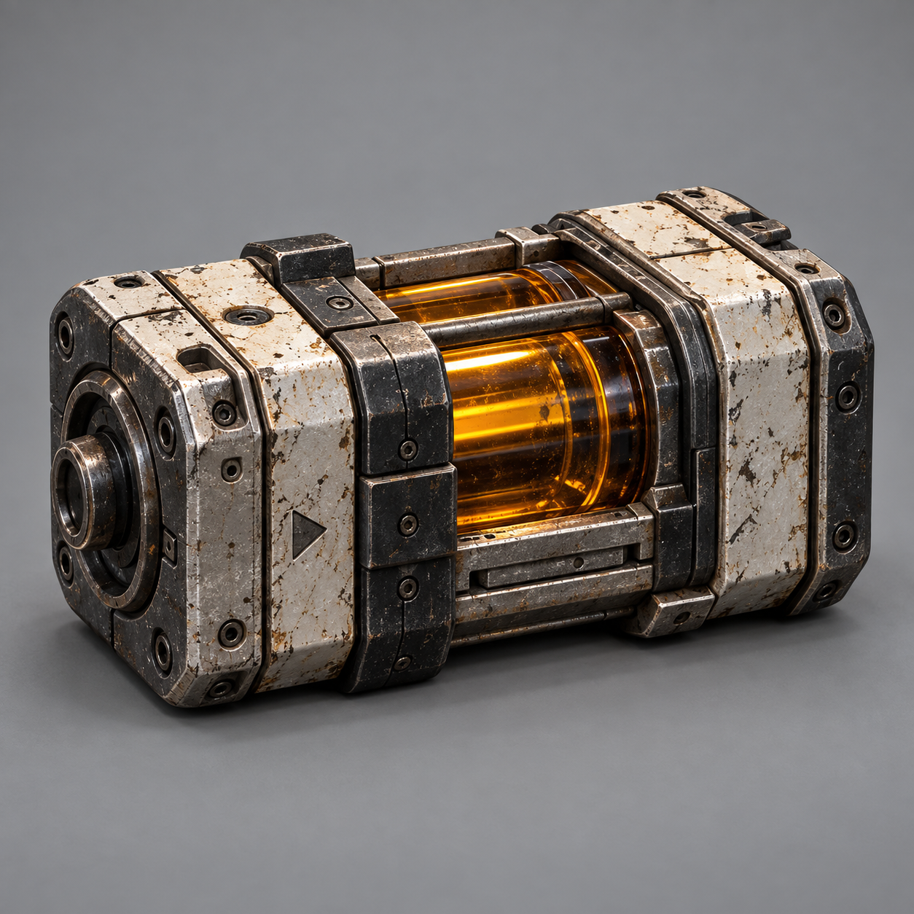
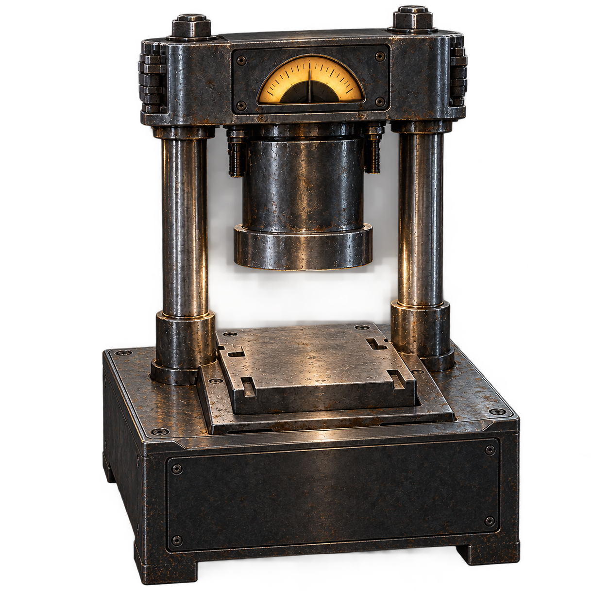
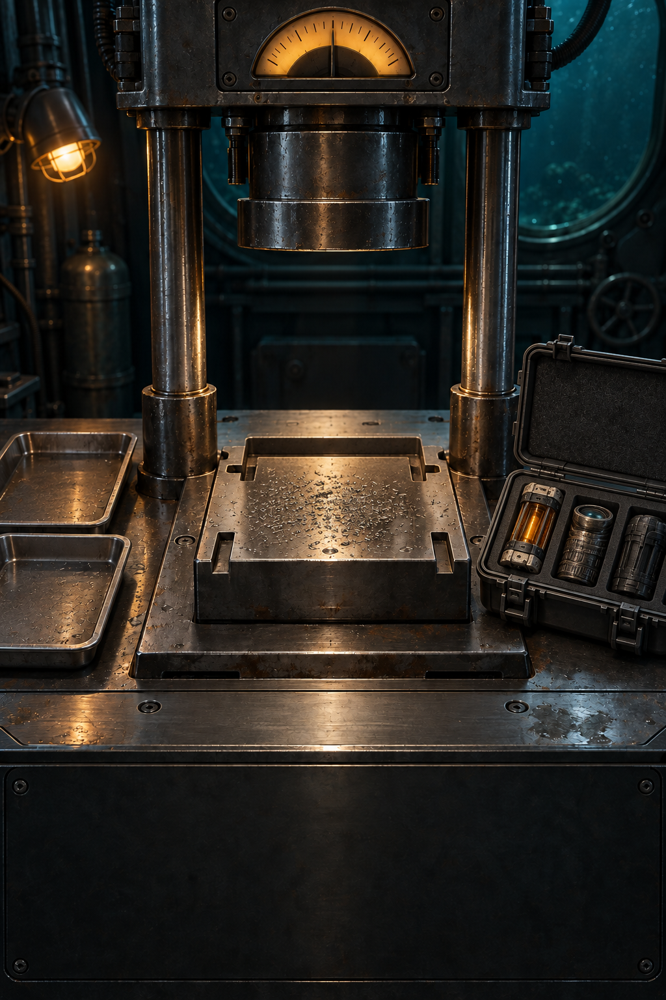

# DEEP PRESS — 시각 기준 5장

모든 그림은 ImageGen으로 생성한 **구현 목표**이며 게임 플레이 캡처가 아니다. 같은 시점·물건·재질을 실제 실행 화면에서 비교해야 아트 완료다. [정확한 프롬프트](prompts.json)와 [PRD](../../prd.md)를 함께 읽는다. 이전 거절된 정원·스프링 이미지는 현재 자산에 포함하지 않았다.

## 01 작업대 — 기준 카메라

짙은 청록색 잠수정 작업실, 두 개의 유압 기둥과 압착판, 중앙의 금속·호박색 회수품, 우측의 회수 케이스를 유지한다. 사실적인 표면이면서 물건과 버튼의 가독성이 우선이다. 버튼·수치·문자는 C가 실제 UI로 렌더한다. 이미지에 보이지 않는 동작을 이미 구현했다고 추정하지 않는다.

## 02 압력 적용

누름판의 접촉 위치, 보호 하우징의 변형, 내부 코어 손상 징후를 검증한다. 기본 mesh 전체를 Y축으로 줄이는 것만으로 최종 압착 연출을 완료하지 않는다. 실제 물건의 접촉면·변형 방향이 맞아야 한다.

## 03 카세트 원본

Meshy 7 재구성 입력. 원본 모델의 뒤쪽 형상은 단일 이미지에서 추정되므로 그대로 정확하다고 주장하지 않는다. B가 회전·압축·바닥 접촉과 PBR 재질을 확인하고 런타임 파생본을 만든다.

## 04 프레스 원본

Meshy 7 재구성 입력. 생성 GLB가 단일 mesh일 수 있다. 기둥·실린더·누름판을 실제 움직임에 맞게 분리하고 피벗을 정리해야 한다. 이 원본은 완성 애니메이션 장치가 아니다.

## 05 회수 성공

회수 케이스에 보관된 물건과 안정된 압착판의 대비를 참고한다. 그림의 물건 개수·수치·부피는 게임 판정의 근거가 아니다. 실제 상태·보관 수·점수는 A의 snapshot만 따른다.

## 실제 화면과 대조하는 절차

같은 세로 비율에서 시작/압축/정착/손상/보관 화면을 캡처한다. 좌우로 비교하며 (1) 주된 실루엣과 상대 크기, (2) 카메라 구도, (3) 금속·유리·복합재의 구별, (4) 청록 환경광과 호박색 포인트, (5) 표면 접촉과 그림자, (6) 변형의 설득력, (7) 작은 화면 가독성을 각각 통과/미달/미검증으로 남긴다. B handoff에 실제 화면과 기기·빌드·프레임 성능을 첨부한다. 컨셉 이미지를 캔버스 배경으로 띄운 것만으로 3D 구현 완료라고 하지 않는다.

첫 생성 모델을 받은 뒤에는 재생성보다 원본 보존·부품 분리·최적화·재질 조정부터 한다. 추가 유료 작업을 기존 완료 작업의 자동 재시도로 소비하지 않는다. Meshy 계정·토큰·서명 다운로드 URL은 저장소와 공유 컨텍스트에 넣지 않는다.
